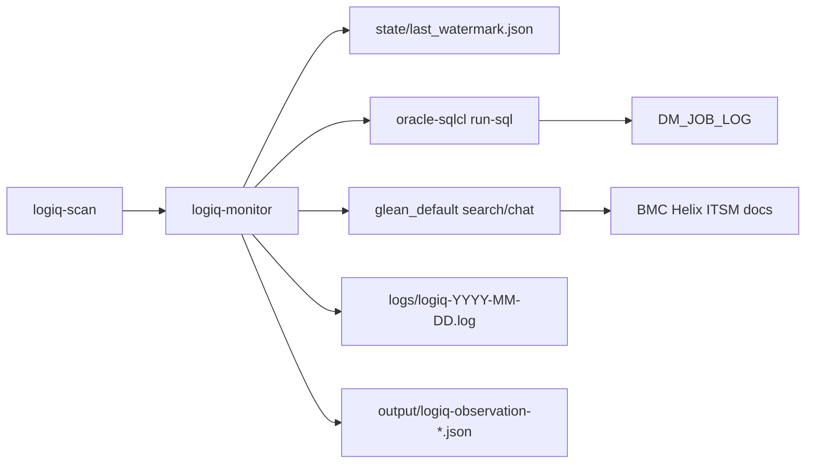

# FAM LogIQ Monitoring Agent

On-demand Cursor agent that monitors `DM_JOB_LOG.error_message` on the FAM dev database (`INTDEVFAM@DWMSDEV`), searches Glean for similar BMC Helix ITSM incidents, and suggests resolutions.

## Prerequisites

These MCP servers must be enabled in Cursor (global `mcp.json`):

| MCP | Purpose |
|-----|---------|
| `oracle-sqlcl` | Query `DM_JOB_LOG` on FAM dev DB |
| `glean_default` | Search Helix ITSM / FAM knowledge (`search`, `chat`, `read_document`) |

## Quick Start

1. Open this workspace in Cursor.
2. Run the **logiq-scan** command (`/logiq-scan`) or invoke the **logiq-monitor** agent (`@logiq-monitor`).
3. Review the summary in chat, the daily log file under `logs/`, and the observation JSON under `output/`.

## Invocation

### Command (recommended)

```
/logiq-scan
```

Optional flags (include in your prompt when invoking):

| Flag | Effect |
|------|--------|
| `--reset-watermark` | Reprocess from scratch (watermark set to 0) |
| `--limit N` | Process at most N error rows per run |
| `--days N` | Search for errors within the past N days (default 365) |

### Agent

Select the **logiq-monitor** agent and ask it to scan for new errors.

## How It Works



1. Load watermark from `state/last_watermark.json`.
2. Poll `DM_JOB_LOG` for new rows with non-empty `error_message`.
3. For each error: Glean search → read top documents → chat for resolution synthesis.
4. Append structured entry to today's log file.
5. Write structured observation JSON to `output/logiq-observation-{scanStarted}.json`.
6. Advance watermark to the highest processed row ID.

## Project Layout

```
FAM_LogIQ/
├── .cursor/
│   ├── agents/logiq-monitor.md    # Agent definition
│   ├── commands/logiq-scan.md     # Slash command
│   └── rules/logiq-rules.md       # Workflow protocols
├── config/
│   ├── dm_job_log.sql             # Schema discovery + poll queries
│   └── glean_prompts.md           # Glean prompt templates
├── state/                         # Watermark (gitignored)
├── logs/                          # Daily log output (gitignored)
├── output/                        # Per-scan observation JSON (gitignored)
└── README.md
```

## Watermark Reset

To reprocess all errors from the beginning, invoke with `--reset-watermark` or delete `state/last_watermark.json` and run again.

## Example Log Entry

```
=== LogIQ Entry ===
Time: 2026-05-30T14:30:00Z
JobLogId: 12345
Job: BATCH_INVOICE_RUN
Error: ORA-01403: no data found ...
GleanSearchQuery: ORA-01403 FAM "Financial Accounting Manager" Helix
SimilarIncidents: [title + URL list]
SuggestedResolution: ...
===
```

## Observation Output

Each scan also writes a machine-readable JSON file:

```
output/logiq-observation-20260604T054800Z.json
```

The file contains scan metadata (`status`, watermarks, lookback, limit) and an `observations` array with one object per processed error (Glean query, similar incidents, suggested resolution). See `.cursor/rules/logiq-rules.md` for the full schema.

## Troubleshooting

| Symptom | Action |
|---------|--------|
| DB connection error | Confirm `oracle-sqlcl` MCP is enabled and INTDEVFAM@DWMSDEV is reachable |
| Empty Glean results | Refine keywords; verify Helix ITSM tickets are indexed in Glean |
| "No new errors" every run | Watermark is current; use `--reset-watermark` to reprocess |
| Schema column mismatch | Run schema discovery query in `config/dm_job_log.sql`; update column names |

## License

Internal CSG use.
